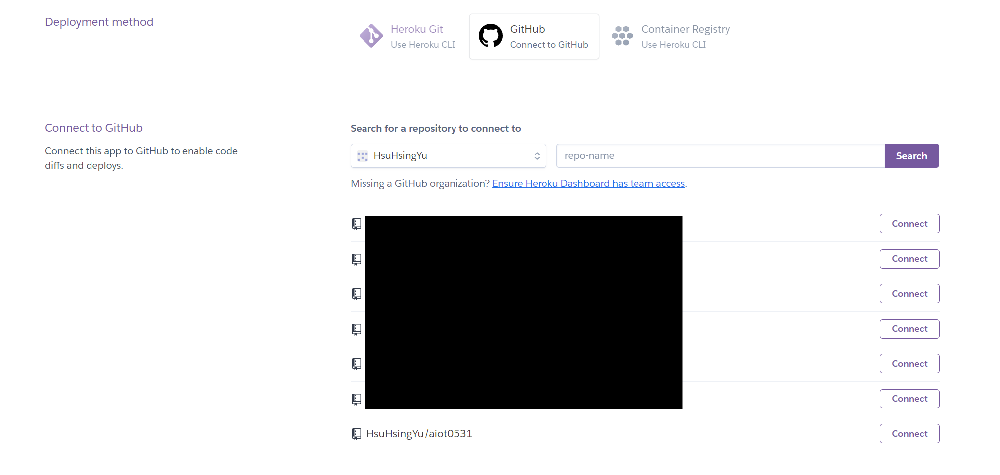
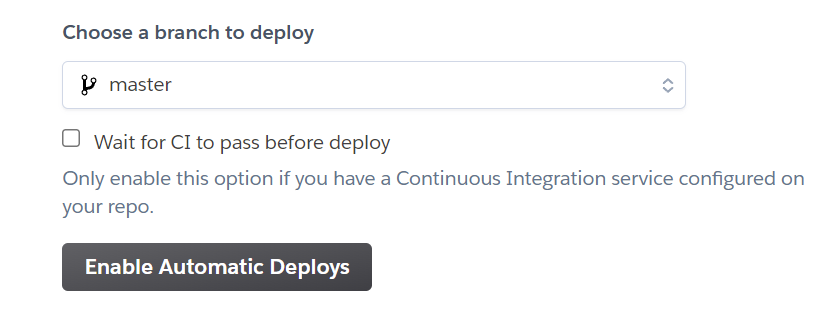
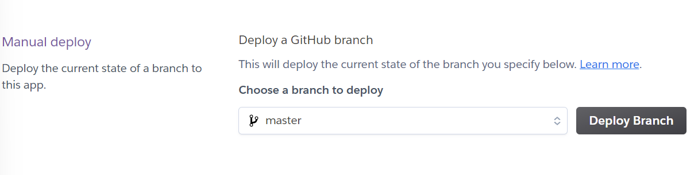
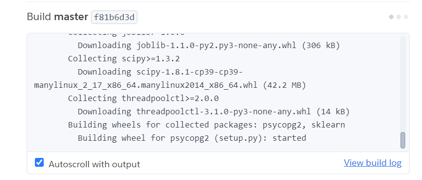
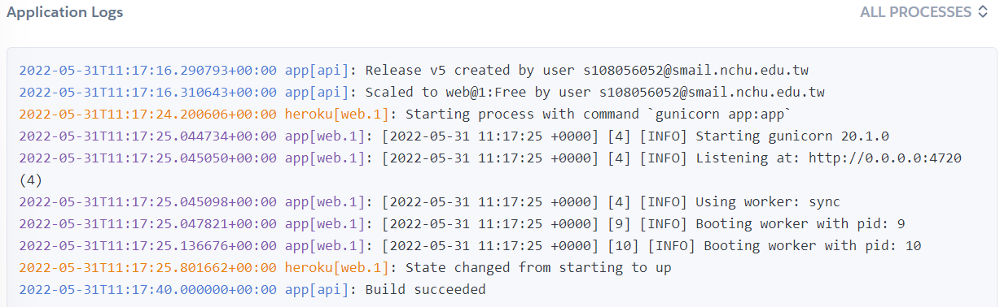
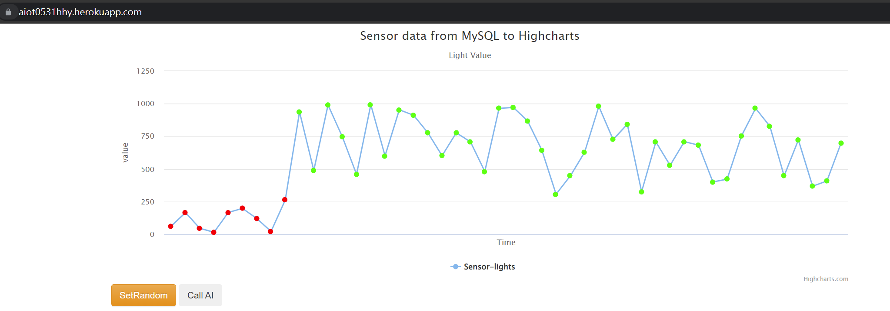
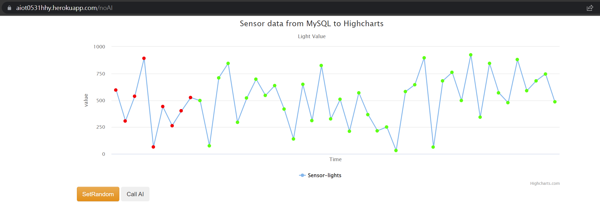

# AIoT Github

## Lecture 16: IoT Flask Web (deploy to heroku)
### Author: Hsu Hsing Yu

###  step 0: 
* 註冊 Heroku, github 請下載 HeidiSQL, VS code
* git clone https://github.com/huanchen1107/aiot0530-start-no-token 到 local\aiot0531 folder
* 把local的 \aiot0531\.git 殺掉 (產生自己的git管理員) 方便建立新的git repository 
* 推送至github建立新的aiot repository

### step 1 : Clone this github
```
git clone https://github.com/huanchen1107/aiot0530-start-no-token
```

### step 2 : install some package
* 開始終端機(ctrl+shift+`)並輸入以下程式碼
```python
pip install gunicorn Flask==2.0.1 Jinja2==3.0.1 psycopg2 sklearn pandas numpy 
```

### step 3: add an heroku postgredb

* register heroku account
* go to dashboard
* new an app
* go to resource and add-on an Heroku postgredb
    * 選擇 heroku postgred來建立資料庫
    
    * 打開資料庫的相關資訊 (點擊view credentials...)
    

### step 4: login to heroku pstgredb using HeidiSQL
* 新建輸入網址名稱 (aiot0531hhy.herokuapp.com)
* 網路類型選PostgreSQL
* 其他按照step3的資料庫資訊打
```sql
myserver ="<fill-in-Heroku-Postgredb-DB-sever>"
myuser="<fill-in-Heroku-Postgredb-DB-user>"
mypassword="<fill-in-Heroku-Postgredb-DB-pwd>"
mydb="<fill-in-Heroku-Postgredb-DB-db>"
```

### step 5: import postgredb (in db/postgre.db)
* 將db資料夾中的postgres.sql匯入資料庫中(他會跑比較久)

完成後的結果


### step 6: setting db in app.py
* 修改db的相關資訊(填入step3的db資訊)
```sql
myserver ="<fill-in-Heroku-Postgredb-DB-sever>"
myuser="<fill-in-Heroku-Postgredb-DB-user>"
mypassword="<fill-in-Heroku-Postgredb-DB-pwd>"
mydb="<fill-in-Heroku-Postgredb-DB-db>"
```


### step 7: testing locally by running python app.py
* 按ctrl+shift+`開啟終端機輸入 ```python app.py```來測試local (因為是遠端的所以會比較慢)
* 測試成功


### step 8: deploy to github (new public github repository)

delete .git and git remote add origin master github.com/xxxxx
* 註:在step0的時候，就已經先將原本的git刪除，並重新建立public的github repositoy了，所以直接使用目前的github repository即可


### step 9: Heroku deploy from github
* 進入heroku裡，選擇剛剛建立的app後點選deploy
* 連結到github

* 選擇現在用的repositoy(aiot0531)
* 選enable automatic deploys

* 再點deploy branch

* 就可以看到正在build

* 完成


### step 10: Complete

最後完成的heroku網址: https://aiot0531hhy.herokuapp.com
* 點擊網址進入後的畫面

* 點擊 SetRandom

* 點擊 Call AI


